<picture><source media="(prefers-color-scheme: dark)" srcset="https://capsule-render.vercel.app/api?type=soft&animation=twinkling&height=150&text=wuli666&fontSize=46&fontAlignY=40&desc=LLM%20serving%20%C2%B7%20omni%20models%20%C2%B7%20infra&descAlignY=68&descSize=16&color=0:1a1b27,100:3d59a1&fontColor=ffffff"/></picture>

<i>Just hoping to be seen.</i>

  

  <picture><source media="(prefers-color-scheme: dark)" srcset="https://skillicons.dev/icons?i=python&theme=dark"/></picture>
  <picture><source media="(prefers-color-scheme: dark)" srcset="https://skillicons.dev/icons?i=pytorch&theme=dark"/></picture>
  <picture><source media="(prefers-color-scheme: dark)" srcset="assets/cuda.svg"/></picture>
  <picture><source media="(prefers-color-scheme: dark)" srcset="assets/triton.svg"/></picture>
  <picture><source media="(prefers-color-scheme: dark)" srcset="assets/vllm.svg"/></picture>
  <picture><source media="(prefers-color-scheme: dark)" srcset="assets/onnx.svg"/></picture>
  <picture><source media="(prefers-color-scheme: dark)" srcset="assets/rknn.svg"/></picture>
  <picture><source media="(prefers-color-scheme: dark)" srcset="https://skillicons.dev/icons?i=cpp&theme=dark"/></picture>
  <picture><source media="(prefers-color-scheme: dark)" srcset="https://skillicons.dev/icons?i=linux&theme=dark"/></picture>
  <picture><source media="(prefers-color-scheme: dark)" srcset="https://skillicons.dev/icons?i=docker&theme=dark"/></picture>
  <picture><source media="(prefers-color-scheme: dark)" srcset="https://skillicons.dev/icons?i=ts&theme=dark"/></picture>

### 🚀 Contributing to

  <a href="https://github.com/vllm-project/vllm-omni/pulls?q=is%3Apr+author%3Awuli666+is%3Amerged"><picture><source media="(prefers-color-scheme: dark)" srcset="assets/cards/vllm-omni.svg"/></picture></a>
  <a href="https://github.com/vllm-project/semantic-router/pulls?q=is%3Apr+author%3Awuli666+is%3Amerged"><picture><source media="(prefers-color-scheme: dark)" srcset="assets/cards/semantic-router.svg"/></picture></a>
  <a href="https://github.com/google/langextract/pulls?q=is%3Apr+author%3Awuli666+is%3Amerged"><picture><source media="(prefers-color-scheme: dark)" srcset="assets/cards/langextract.svg"/></picture></a>
  <a href="https://github.com/NousResearch/hermes-agent/commits?author=wuli666"><picture><source media="(prefers-color-scheme: dark)" srcset="assets/cards/hermes-agent.svg"/></picture></a>

### 📊 Stats

  <picture><source media="(prefers-color-scheme: dark)" srcset="https://github-profile-summary-cards.vercel.app/api/cards/profile-details?username=wuli666&theme=tokyonight"/></picture>

  <picture><source media="(prefers-color-scheme: dark)" srcset="https://github-profile-summary-cards.vercel.app/api/cards/stats?username=wuli666&theme=tokyonight"/></picture>
  <picture><source media="(prefers-color-scheme: dark)" srcset="https://github-profile-summary-cards.vercel.app/api/cards/productive-time?username=wuli666&utcOffset=8&theme=tokyonight"/></picture>

<picture><source media="(prefers-color-scheme: dark)" srcset="https://raw.githubusercontent.com/wuli666/wuli666/output/snake-dark.svg"/></picture>
